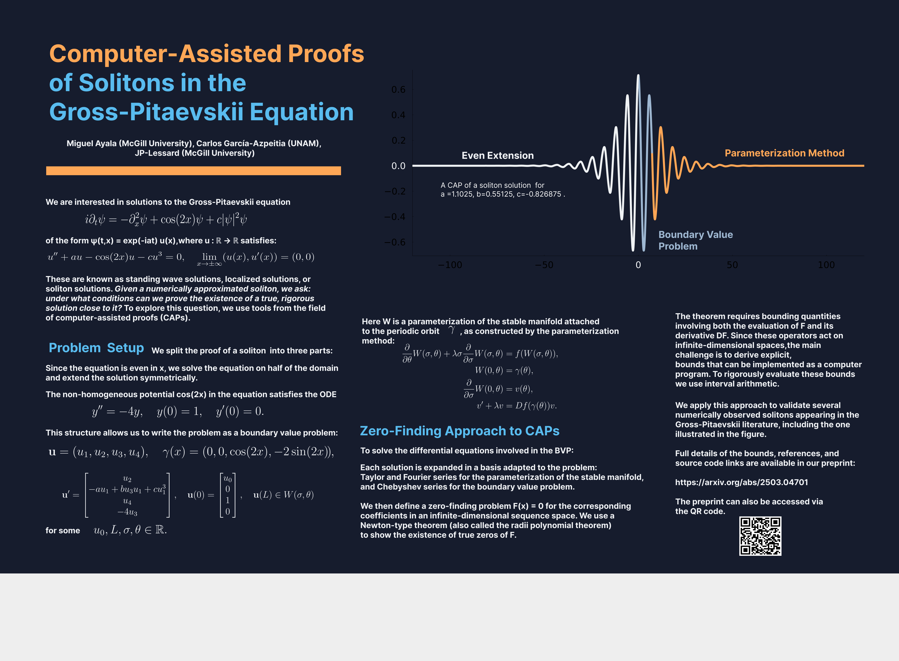

# SolitonsInBECs

This repository contains the Julia codes associated with the paper: "Computer-Assisted Proofs of Gap Solitons in Bose-Einstein Condensates" by M Ayala, C García-Azpeitia and J-P Lessard.

[🔗 Link to Journal]([https://link.springer.com/article/10.1007/s00332-026-10242-2](https://can01.safelinks.protection.outlook.com/?url=https%3A%2F%2Frdcu.be%2Fe5iO6&data=05%7C02%7Cmiguel.ayala%40mail.mcgill.ca%7Cbd5ec4da86ec4fc2485908de72e4ee94%7Ccd31967152e74a68afa9fcf8f89f09ea%7C0%7C0%7C639074524754541685%7CUnknown%7CTWFpbGZsb3d8eyJFbXB0eU1hcGkiOnRydWUsIlYiOiIwLjAuMDAwMCIsIlAiOiJXaW4zMiIsIkFOIjoiTWFpbCIsIldUIjoyfQ%3D%3D%7C0%7C%7C%7C&sdata=%2BfxNO%2FWvgibwB4t7lE5L0GLLJgJSaqYLYZbmJekGWCE%3D&reserved=0))

[🔗 arXiv:2503.04701](https://arxiv.org/abs/2503.04701)  

## Abstract
We provide a framework for turning a numerical simulation of a gap soliton in the one-dimensional Gross-Pitaevskii equation into a formal mathematical proof of its existence. These nonlinear localized solutions play a central role in understanding Bose-Einstein condensates (BECs). We reformulate the problem of proving their existence as the search for homoclinic orbits in a dynamical system. We then apply computer-assisted proof techniques to obtain verifiable conditions under which a numerically approximated trajectory corresponds to a true homoclinic orbit. This work also presents the first examples of computer-assisted proofs of gap solitons in the Gross-Pitaevskii equation on non-perturbative parameter regimes. 

