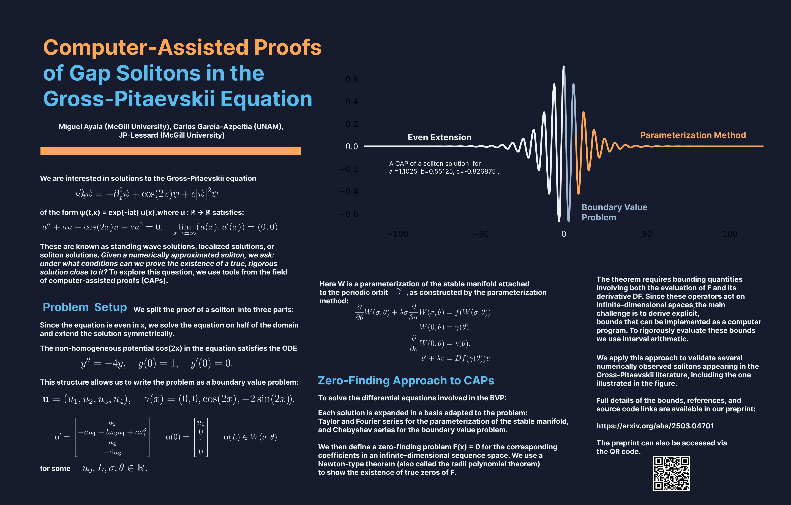

# SolitonsInBECs

This repository contains the Julia codes associated with the paper: "Computer-Assisted Proofs of Gap Solitons in Bose-Einstein Condensates" by M Ayala, C García-Azpeitia and J-P Lessard.

[🔗 arXiv:2503.04701](https://arxiv.org/abs/2503.04701)  

## Abstract
We provide a framework for turning a numerical simulation of a gap soliton in the one-dimensional Gross-Pitaevskii equation into a formal mathematical proof of its existence. These nonlinear localized solutions play a central role in understanding Bose-Einstein condensates (BECs). We reformulate the problem of proving their existence as the search for homoclinic orbits in a dynamical system. We then apply computer-assisted proof techniques to obtain verifiable conditions under which a numerically approximated trajectory corresponds to a true homoclinic orbit. This work also presents the first examples of computer-assisted proofs of gap solitons in the Gross-Pitaevskii equation on non-perturbative parameter regimes. 

